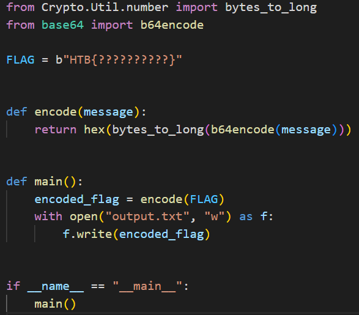
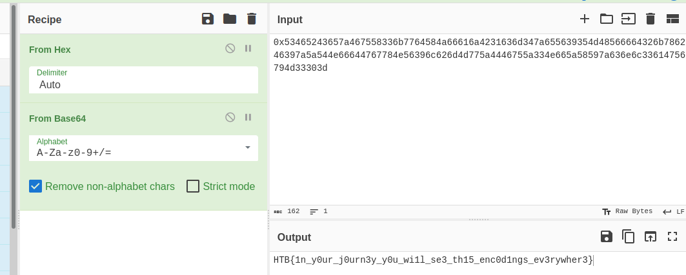

CHALLENGE NAME: Ancient Encodings
DESCRIPTION: Your initialization sequence requires loading various programs to gain the necessary knowledge and skills for your journey. Your first task is to learn the ancient encodings used by the aliens in their communication.


</br></br></br>


Lets start by reading the encryption code ...



Here it is very simple encode bt convert it to base64 then to hex and we can do the revers staps with the encrypted message

I used CyberChef to do that ... 



Here is the flag :)

```HTB{1n_y0ur_j0urn3y_y0u_wi1l_se3_th15_enc0d1ngs_ev3rywher3}```
