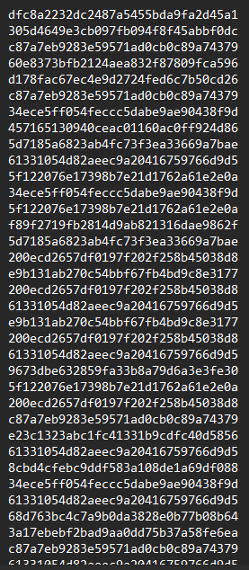

CHALLENGE NAME: Perfect Synchronization

DESCRIPTION: The final stage of your initialization sequence is mastering cutting-edge technology tools that can be life-changing. One of these tools is quipqiup, an automated tool for frequency analysis and breaking substitution ciphers. This is the ultimate challenge, simulating the use of AES encryption to protect a message. Can you break it?

</br></br></br>


After reading the description, They minsion cutting-edge technology tools and one of these tools is ```quipqiup``` ...

After small search about it. ```quipqiup``` is a fast and automated cryptogram solver by Edwin Olson. It can solve simple substitution ciphers often found in newspapers, including puzzles like cryptoquips (in which word boundaries are preserved) and patristocrats (inwhi chwor dboun darie saren t). 

After take a took in to the source.py code 


we will able to see that all letters are using the same key and the same salt to encrypt ...
This means that the same letters will have the same value. So, it is vulnerable, and we can use ```quipquip``` to find the real message...

Here in each line we can see the encrypted letter ...



Now lets use any program to give each value a different letter then we can ues ```quipquip``` because it is too large to handle by the webiste ...

I uesed java to do that by creating a class called ```Dictionary``` to act like a dictionary for the larg values.

```
import java.util.ArrayList;

public class Dictionary {

    public ArrayList<String> Dletters = new ArrayList<>();
    public ArrayList<String> Oletters = new ArrayList<>();
    private char c = 'a';

    public boolean contains(String d) return Dletters.contains(d); 
    
    public void update(String d){
        Dletters.add(d);
        Oletters.add(String.valueOf(c));
        c++;
    }
    
    public String getC(String d){
        int n = Dletters.indexOf(d);
        return Oletters.get(n);
    }
}

```

Then on the main methed  

``` 
    public static void main(String[] args) throws FileNotFoundException {
    
        File myObj = new File(".\\output.txt");
        Scanner s = new Scanner(myObj);
        ArrayList<String> a = new ArrayList<>();

        while (s.hasNextLine()) a.add(s.nextLine());

        String myStr = "";

        Dictionary dictionary = new Dictionary();
        for (String str: a) {
        
            if (dictionary.contains(str)) myStr+= dictionary.getC(str);
            
            else{
                dictionary.update(str);
                myStr+=dictionary.getC(str);
            }
        }
        
        System.out.println(myStr);
    }
        
        
```

The output >>> 

```
abcdecfghijfjkhlmlimlinjlcoipfiqrciajgqiqrjqimfijfhismtcfilqbcqgripaiubmqqcfikjfsejscigcbqjmfikcqqcblijfoigpvnmfjqmpflipaikcqqcblipggebiumqritjbhmfsiabcdecfgmclivpbcptcbiqrcbcimlijigrjbjgqcbmlqmgiomlqbmneqmpfipaikcqqcbliqrjqimlibpesrkhiqrciljvciapbijkvplqijkkiljvwkclipaiqrjqikjfsejscimfigbhwqjfjkhlmliabcdecfghijfjkhlmlijklpixfpufijligpefqmfsikcqqcblimliqrcilqeohipaiqrciabcdecfghipaikcqqcblipbisbpewlipaikcqqcblimfijigmwrcbqcyqiqrcivcqrpoimlielcoijlijfijmoiqpinbcjxmfsigkjllmgjkigmwrcbliabcdecfghijfjkhlmlibcdembclipfkhijinjlmgiefocblqjfomfsipaiqrcilqjqmlqmglipaiqrciwkjmfqcyqikjfsejscijfoilpvciwbpnkcvilpktmfsilxmkklijfoimaiwcbapbvcoinhirjfoiqpkcbjfgciapbicyqcflmtcikcqqcbinppxxccwmfsioebmfsiupbkoiujbimminpqriqrcinbmqmlrijfoiqrcijvcbmgjflibcgbemqcoigpocnbcjxcblinhiwkjgmfsigbpllupboiwezzkclimfivj{pbifculwjwcblijfoibeffmfsigpfqclqliapbiurpigpekoilpktciqrcviqrciajlqclqilctcbjkipaiqrcigmwrcblielcoinhiqrcijymliwpucbliucbcinbcjxjnkcielmfsiabcdecfghijfjkhlmliapbicyjvwkcilpvcipaiqrcigpflekjbigmwrcblielcoinhiqrci{jwjfclcivcgrjfmgjkivcqrpolipaikcqqcbigpefqmfsijfoilqjqmlqmgjkijfjkhlmliscfcbjkkhirqn|j}lmvwkc}lenlqmqeqmpf}ml}ucjx~igjboiqhwcivjgrmfcbhiucbciamblqielcoimfiupbkoiujbimmiwpllmnkhinhiqrcielijbvhlilmliqpojhiqrcirjboiupbxipaikcqqcbigpefqmfsijfoijfjkhlmlirjlinccfibcwkjgcoinhigpvweqcbilpaqujbciurmgrigjfigjbbhipeqilegrijfjkhlmlimfilcgpfoliumqrivpocbfigpvweqmfsiwpucbigkjllmgjkigmwrcblijbciefkmxckhiqpiwbptmocijfhibcjkiwbpqcgqmpfiapbigpfamocfqmjkiojqjiwezzkciwezzkciwezzkc
```

Now lets copy this to <a href = "https://quipqiup.com">quip-quip</a>

And start out journy to find clues for each letter ...

For example we can see the first word is ```frequency  ``` = ```abcdecfgh ``` ...


I wrote another pise of code to do that and getting clues step by step ...

```
        String myNewStr = "";
        for(int i=0;myStr.length()>i;i++){
            if(myStr.charAt(i) == 'a') myNewStr += 'F';
            else if(myStr.charAt(i) == 'b') myNewStr += 'R';
            else if(myStr.charAt(i) == 'c') myNewStr += 'E';
            else if(myStr.charAt(i) == 'd') myNewStr += 'Q';
            else if(myStr.charAt(i) == 'e') myNewStr += 'U';
            else if(myStr.charAt(i) == 'f') myNewStr += 'N';
            else if(myStr.charAt(i) == 'g') myNewStr += 'C';
            else if(myStr.charAt(i) == 'h') myNewStr += 'Y';
            else if(myStr.charAt(i) == 'i') myNewStr += ' ';
            else if(myStr.charAt(i) == 'j') myNewStr += 'A';
            else if(myStr.charAt(i) == 'k') myNewStr += 'L';
            else if(myStr.charAt(i) == 'l') myNewStr += 'S';
            else if(myStr.charAt(i) == 'm') myNewStr += 'I';
            else if(myStr.charAt(i) == 'n') myNewStr += 'B';
            else if(myStr.charAt(i) == 'o') myNewStr += 'D';
            else if(myStr.charAt(i) == 'p') myNewStr += 'O';
            else if(myStr.charAt(i) == 'q') myNewStr += 'T';
            else if(myStr.charAt(i) == 'r') myNewStr += 'H';
            else if(myStr.charAt(i) == 's') myNewStr += 'G';
            else if(myStr.charAt(i) == 't') myNewStr += 'V';
            else if(myStr.charAt(i) == 'u') myNewStr += 'W';
            else if(myStr.charAt(i) == 'v') myNewStr += 'M';
            else if(myStr.charAt(i) == 'w') myNewStr += 'P';
            else if(myStr.charAt(i) == 'x') myNewStr += 'K';
            else if(myStr.charAt(i) == 'y') myNewStr += 'X';
            else if(myStr.charAt(i) == 'z') myNewStr += 'Z';
            else if(myStr.charAt(i) == '|') myNewStr += '{';
            else if(myStr.charAt(i) == '~') myNewStr += '}';
            else if(myStr.charAt(i) == '}') myNewStr += '_';
            else if(myStr.charAt(i) == '{') myNewStr += 'G';
            else myNewStr += myStr.charAt(i);
        }
        System.out.println(myNewStr);
```

I converted it to upper case because if you look at the source.py file, we can see there is a filter that makes sure that all letters are upper case or ```{``` or ```_``` or ```}``` ...

```assert all([x.isupper() or x in '{_} ' for x in MESSAGE])```


Now after run the code we will get ...

```
FREQUENCY ANALYSIS IS BASED ON THE FACT THAT IN ANY GIVEN STRETCH OF WRITTEN LANGUAGE CERTAIN LETTERS AND COMBINATIONS OF LETTERS OCCUR WITH VARYING FREQUENCIES MOREOVER THERE IS A CHARACTERISTIC DISTRIBUTION OF LETTERS THAT IS ROUGHLY THE SAME FOR ALMOST ALL SAMPLES OF THAT LANGUAGE IN CRYPTANALYSIS FREQUENCY ANALYSIS ALSO KNOWN AS COUNTING LETTERS IS THE STUDY OF THE FREQUENCY OF LETTERS OR GROUPS OF LETTERS IN A CIPHERTEXT THE METHOD IS USED AS AN AID TO BREAKING CLASSICAL CIPHERS FREQUENCY ANALYSIS REQUIRES ONLY A BASIC UNDERSTANDING OF THE STATISTICS OF THE PLAINTEXT LANGUAGE AND SOME PROBLEM SOLVING SKILLS AND IF PERFORMED BY HAND TOLERANCE FOR EXTENSIVE LETTER BOOKKEEPING DURING WORLD WAR II BOTH THE BRITISH AND THE AMERICANS RECRUITED CODEBREAKERS BY PLACING CROSSWORD PUZZLES IN MAGOR NEWSPAPERS AND RUNNING CONTESTS FOR WHO COULD SOLVE THEM THE FASTEST SEVERAL OF THE CIPHERS USED BY THE AXIS POWERS WERE BREAKABLE USING FREQUENCY ANALYSIS FOR EXAMPLE SOME OF THE CONSULAR CIPHERS USED BY THE GAPANESE MECHANICAL METHODS OF LETTER COUNTING AND STATISTICAL ANALYSIS GENERALLY HTB{A_SIMPLE_SUBSTITUTION_IS_WEAK} CARD TYPE MACHINERY WERE FIRST USED IN WORLD WAR II POSSIBLY BY THE US ARMYS SIS TODAY THE HARD WORK OF LETTER COUNTING AND ANALYSIS HAS BEEN REPLACED BY COMPUTER SOFTWARE WHICH CAN CARRY OUT SUCH ANALYSIS IN SECONDS WITH MODERN COMPUTING POWER CLASSICAL CIPHERS ARE UNLIKELY TO PROVIDE ANY REAL PROTECTION FOR CONFIDENTIAL DATA PUZZLE PUZZLE PUZZLE
```

Here is the flag :)

```HTB{A_SIMPLE_SUBSTITUTION_IS_WEAK}```
