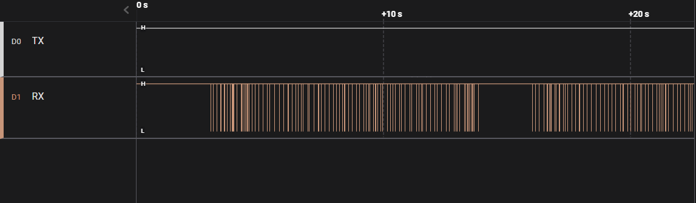
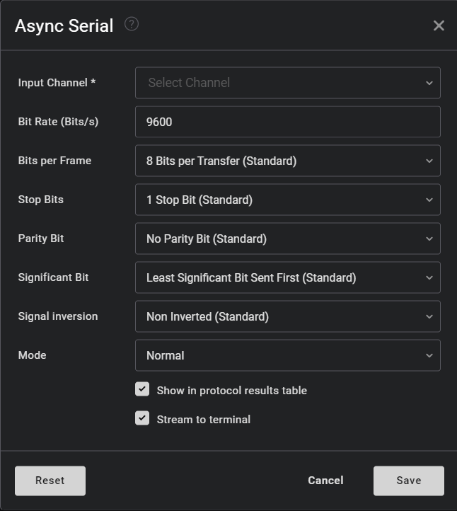
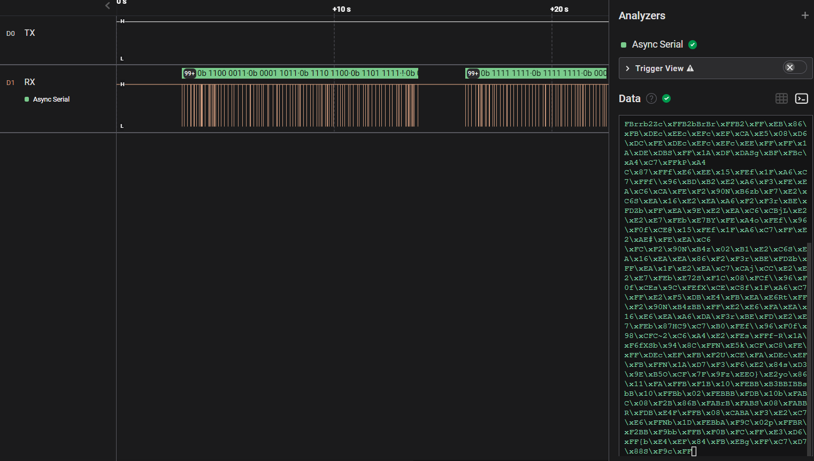
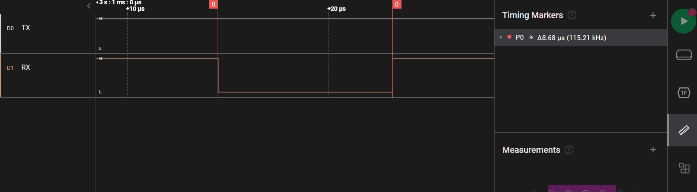
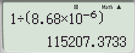
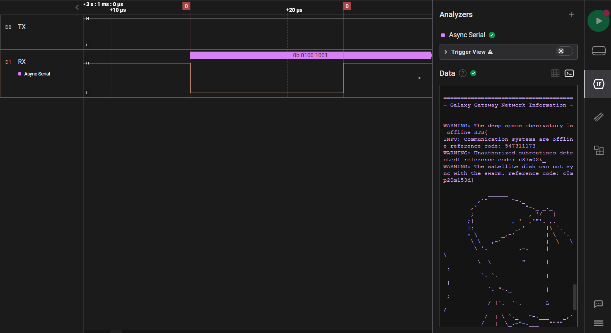

CHALLENGE NAME: Debug

DESCRIPTION: Your team has recovered a satellite dish that was used for transmitting the location of the relic, but it seems to be malfunctioning. There seems to be some interference affecting its connection to the satellite system, but there are no indications of what it could be. Perhaps the debugging interface could provide some insight, but they are unable to decode the serial signal captured during the device's booting sequence. Can you help to decode the signal and find the source of the interference?


Here we will use application called "Logic" 
Logic analyzers are used to test circuits in embedded systems and microcontrollers, robotics, and automotive computers. Logic analyzers may also work in mixed signal systems that use both analog and digital signals.




Then we will try to read the signals by using "Async Serial" tool in the app
but we need to make some configreation first here ...


 
First thing is Input channel in our case the channel is on RX

Then we are not ready yet becase the Bit Rate is not appropriate to our signals.
And if we try to see it with the wrong Bit Rate we will see unreadable message 



So to find the best Bit Rate that fits with our data we need to calculate signals speed per second.
To do that Twe need to read the signal width



Then divide one by the signal width and we will got the speed (Hz) as shown in the previous image.



Then save Bit Rate = 115207  ...

And we got a readable message ...



By searching on the message we can find the flag ...
Here is the flag :)

```HTB{547311173_n37w02k_c0mp20m153d}```


