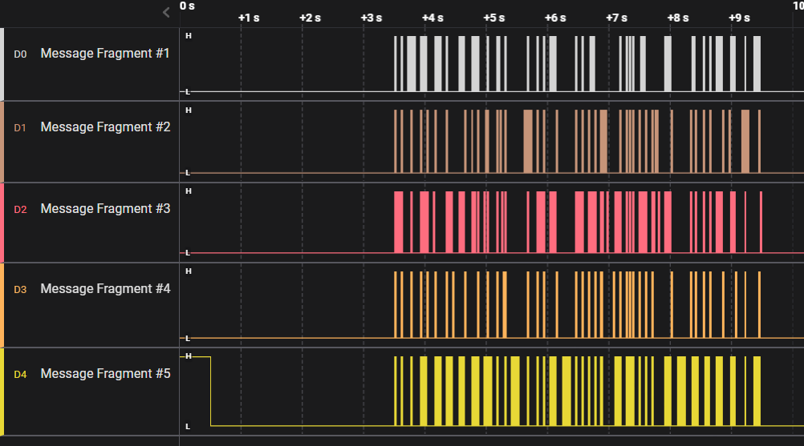
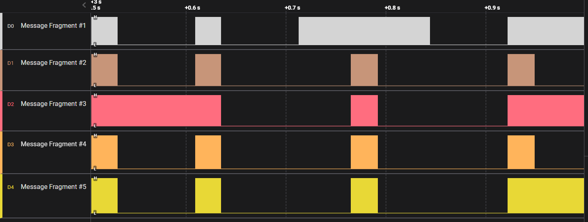

CHALLENGE NAME: Timed Transmission

DESCRIPTION: As part of your initialization sequence, your team loaded various tools into your system, but you still need to learn how to use them effectively. They have tasked you with the challenge of finding the appropriate tool to open a file containing strange serial signals. Can you rise to the challenge and find the right tool?


As mintion on the description we just need to find the appropriate tool to open the file containing strange serial signals 
The file name is Captured_Signals.sal
after searching on the internet you can find "Logic"
Logic analyzers are used to test circuits in embedded systems and microcontrollers, robotics, and automotive computers. Logic analyzers may also work in mixed signal systems that use both analog and digital signals.


So, after open the file using it ...


 

I kept zooming until my friend saw it on the screen, and it was unpredictable XD ...
The flag is written by signals 



Here is the flag :)

```HTB{b391N_tH3_HArdWAr3_QU3St}```
