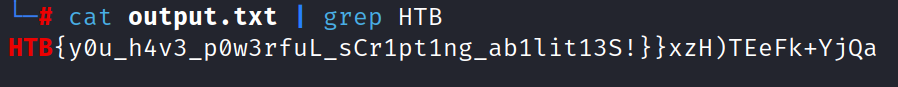

CHALLENGE NAME: Persistence

DESCRIPTION: Thousands of years ago, sending a GET request to /flag would grant immense power and wisdom. Now it's broken and usually returns random data, but keep trying, and you might get lucky... Legends say it works once every 1000 tries.


</br></br></br>

When you send a GET request to /flag you will get a random data ...


So lets try to to request 1000 times and save responses in a text file by creating a python code to do that ...

```
import requests

# define the URL of the web page to be requested
url = "http://IP/flag"

# open a file to save the output
output_file = open("output.txt", "w")

# loop over the number of requests
for i in range(1000):
    # make the request and get the response content
    response = requests.get(url)
    content = response.content

     # convert bytes to string using decode() method
    content_str = content.decode()

    # write the response content to the output file
    output_file.write(content_str)

# close the output file
output_file.close()
```

Then we will use command ```cat output.txt | grep HTB```

Here is the flag :)




```HTB{y0u_h4v3_p0w3rfuL_sCr1pt1ng_ab1lit13S!}```
