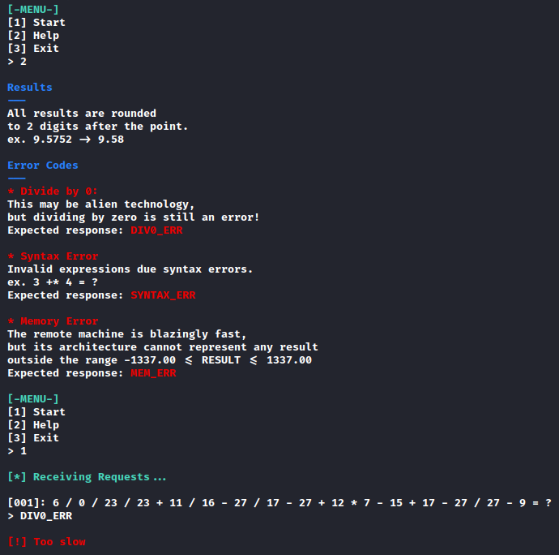

CHALLENGE NAME: Remote computation

DESCRIPTION: The alien species use remote machines for all their computation needs. Pandora managed to hack into one, but broke its functionality in the process. Incoming computation requests need to be calculated and answered rapidly, in order to not alarm the aliens and ultimately pivot to other parts of their network. Not all requests are valid though, and appropriate error messages need to be sent depending on the type of error. Can you buy us some time by correctly responding to the next 500 requests?


</br></br></br>

when we connect to the ip using ```nc``` we will see this ...



But we are too slow ...

So, we need to create a program to do that 
I created a python program that connect to the ip then calculate and answer questions rapidly
```
import socket

# Define the server and port you want to connect to
HOST = '167.172.50.208'
PORT = 30011

#AF_INET for IPv4, SOCK_STREAM for TCP (as opposed to UDP).
clientsocket = socket.socket(socket.AF_INET, socket.SOCK_STREAM)

# Tell the socket what IP and port number to connect to (must be in two brackets because it needs a tuple).
clientsocket.connect((HOST, PORT))

#Recieve 1024 bytes of data.
data = clientsocket.recv(1024)
print(data.decode('utf-8'))
#Split the recieved data by newlines (returns a list).
#data = data.split('\n')

#The first and second elements in our list should be the two numbers we need to add together, so we do that.
result = b'1\n'

#Send our result to the server.
clientsocket.send(result)

#Recieve any response from the server and print it to the screen.
data = clientsocket.recv(1024).decode('utf-8')
lines = data.splitlines()
last_line = lines[-2]
print(last_line)
    
while last_line != '[!] Incorrect response':
    print(last_line)
    q = last_line.replace('=', '').replace('?', '').replace(' ','')[6:]
    try:
        Eval = round(eval(q),2)
        if ((-1337.00 <=Eval) and (Eval <= 1337.00) ):
            r = str(Eval).encode()
        else:
            r = "MEM_ERR".encode()
    except SyntaxError:
        r = "SYNTAX_ERR".encode()
    except ZeroDivisionError:
        r = "DIV0_ERR".encode()
    print(r)
    clientsocket.send(r)
    clientsocket.send(b'\n')
    data = clientsocket.recv(1024).decode('utf-8')
    lines = data.splitlines()
    print(data)
    last_line = lines[-2]
```


Here is the flag ```HTB{d1v1d3_bY_Z3r0_3rr0r}```
