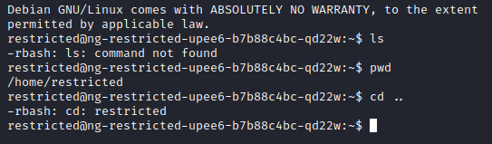
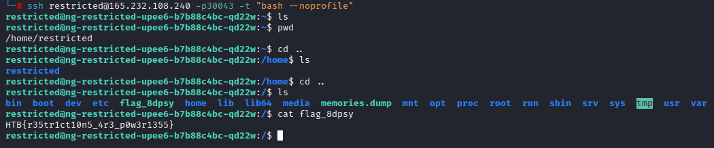

CHALLENGE NAME: Restricted

DESCRIPTION: You 're still trying to collect information for your research on the alien relic. Scientists contained the memories of ancient egyptian mummies into small chips, where they could store and replay them at will. Many of these mummies were part of the battle against the aliens and you suspect their memories may reveal hints to the location of the relic and the underground vessels. You managed to get your hands on one of these chips but after you connected to it, any attempt to access its internal data proved futile. The software containing all these memories seems to be running on a restricted environment which limits your access. Can you find a way to escape the restricted environment ?


</br></br></br>


After take a look on files or using nmap we will able to see that is run an OpenSSH server ...

But what is the user name and password ?

After navigating the files we can see that the user is ```restricted``` and it has no password 


Now lets connect to it ```ssh restricted@IP -pPORT``` 

Then we now connectend to Restricted Shell and not all the commands can work ...



Now after search for how to bypass the Restricted Shell. There are many ways ...

But I used to changing bash to "bash -noprofile" using command ```-t "bash --noprofile"```

Then try to connect again ...

Now, after bypassing the restricted shell, we can navigate directories to find the flag file.



Here is the flag :)

```HTB{r35tr1ct10n5_4r3_p0w3r1355}```


