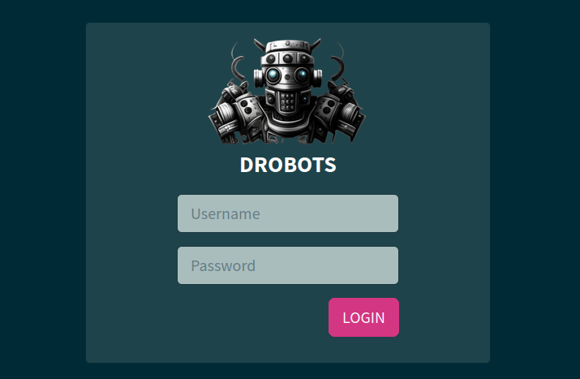
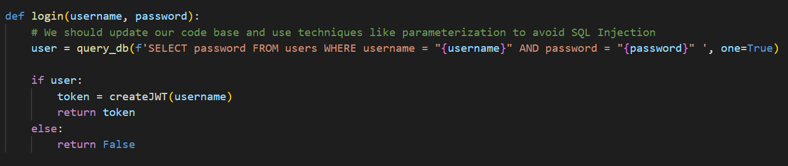
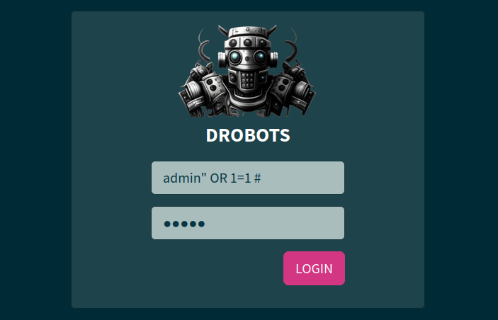
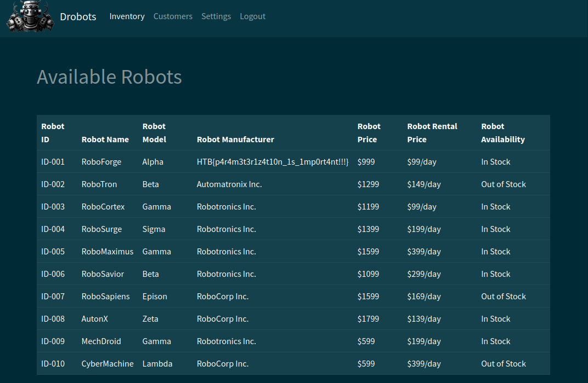

CHALLENGE NAME: Drobots
<br /><br />
DESCRIPTION: Pandora's latest mission as part of her reconnaissance training is to infiltrate the Drobots firm that was suspected of engaging in illegal activities. Can you help pandora with this task?
<br /><br /><br /><br />

After machine is spawned we and connect to it, We can see that it is a login page ...




Now let's go to the files and navigate their contents.
There is a function called login() in the database.py file that matches the username and password in the database.
But, we can clearly see that it is vulnerable due to a basic code injection ...



So, after put username as ```admin" OR 1=1 #```
The command will become like this ``` SELECT password FROM users WHERE username = "admin" OR 1=1 # AND password = "Hello" ``` and we don't care about the password because the rest of the command becomes a comment after "#".

Now let't try that ...



<br />
Then ...



We got the flag :)
